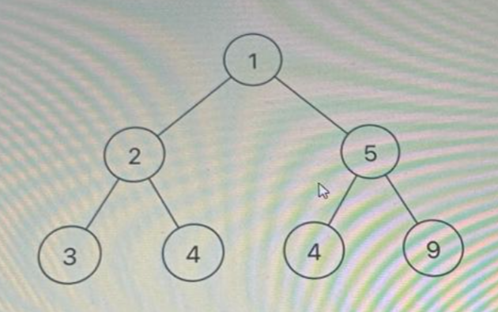

<link rel="stylesheet" href="../test/style.css">

# [Coding Questions](./coding_questions.md)

> ## 1. Problem Statement:

You are given a string of lowercase English alphabets. Your task is to find whether two exactly same strings can be formed using all the characters given in the input string, if not possible then print 'Not Possibl'
If possible then you have to display the new generated string in which all the characters are lexicographically sorted.

#### Constraints:
- The string consists of lowercase English alphabets a-z.
- String length 1:1<= 1 <= 10^5

#### Input Format:

- The first and the only line containing a string.

#### Output Format:

- If Possible to divide the given string into two exactly the same strings, then the output would be one of the two strings. Else
  the output would be 'Not Possible'.

Input 1:

```bash
abcfdcbafada
```

Output 1:

```bash
aabcdf
```

Input 2:

```bash
abcdcb
```

Output 1:

```bash
Not Possible
```

Input 1:

```bash
abcabcde
```

Output 1:

```bash
Not Possible
```

code:

```cpp
#include <iostream>
#include <string>
#include <algorithm>
#include <unordered_map>

using namespace std;

string rearrangeString(string s)
{
    unordered_map<char, int> freq;

    for (char c : s)
    {
        freq[c]++;
    }

    for (auto &p : freq)
    {
        if (p.second % 2 != 0)
        {
            return "Not Possible";
        }
    }

    sort(s.begin(), s.end());

    string str = "";
    for (int i = 0; i < s.size(); i = i + 2)
    {
        str += s[i];
    }

    return str;
}

int main()
{
    string input;
    cin >> input;

    string result = rearrangeString(input);

    cout << result << endl;

    return 0;
}
```

---

---

> ## 2. Problem Statement

Alice owns a Cola stand, where each cola costs $5.
Customers are standing in a queue to buy from Alice, and order one at a time (in the order specified by invoice).
Each customer will only buy one cola and pay with either a $5, $10, or $20 invoice: Alice must provide the correct change to each customer, so that the net transaction is that the customer pays $5.

Note:

- Alice don't have any change in hand at first.

Print true if and only if Alice can provide every customer with correct change else print false.

#### Input Format

- First line contains an integer N, denoting the number of customers
- Next N line contains invoice

#### Constraints

- 0 <= N <= 10000
- invoice[i] will be either 5, 10, or 20.

#### Output Format

- Single line containing the result value

#### Evaluation Parameters

Sample Input1

```
5
5
5
5
5
20
```

Sample Output1

```
true
```

#### Explanation:

From the first 4 customers, Alice collect three $5 invoice in order From the fifth customer, Alice collect a $20 bill and give back a $10 and a $5 invoice. Since all customers got correct change, we output true.

Sample Input2

```
4
5
10
10
20
```

Sample Output2

```
false
```

Execution time limit
2 seconds

code:

```cpp
int N = invoice.size();
    int count5 = 0;
    int count10 = 0;
    for (int i = 0; i < N; i++)
    {
        if (invoice[i] == 5)
        {
            count5++;
        }
        else if (invoice[i] == 10)
        {
            if (count5 < 1)
            {
                return "false";
            }
            count5--;
            count10++;
        }
        else if (invoice[i] == 20)
        {
            if (count10 >= 1 && count5 >= 1)
            {
                count10--;
                count5--;
            }
            else if (count5 >= 3)
            {
                count5 -= 3;
            }
            else
            {
                return "false";
            }
        }
    }
    return "true";
```

---

> ## 3. Problem Statement

You are given a array of plot prices arr[] and a amount N, you have to find the minimum number of consecutive plots you can buy in that amount and print their positions in the array. The amount has to be fully exhausted/spent, If you are unable to spend the amount return array of positions [-1]
Examples:
when input is arr = [2,4,5,4,1,2,5], N = 3
then output is [4,5]
Note: array indexing starts at 0

#### Input Format

- The first line will contain arr space separated integers denoting the input array.
- The second line of each test case will contain a integer N denoting the amount.

#### Output Format

- For each test case, output space-separated integers in a separate line - positions of plots.

#### Evaluation parameters

Sample Input 1

```
2 4 5 4 1 2 5
3
```

Sample Output 1

```
4 5
```

code:

```cpp
#include <iostream>
#include <vector>

using namespace std;

vector<int> findConsecutivePlots(vector<int> arr, int N)
{
    vector<int> positions;
    int sum = 0, start = 0;

    for (int i = 0; i < arr.size(); ++i)
    {
        sum += arr[i];

        while (sum > N)
        {
            sum -= arr[start];
            start++;
        }

        if (sum == N)
        {
            for (int j = start; j <= i; ++j)
            {
                positions.push_back(j);
            }
            return positions;
        }
    }

    return {-1};
}

int main()
{
    vector<int> arr;
    int num, N;
    char c;

    // Input array
    while (cin >> num)
    {
        arr.push_back(num);
        if (cin.peek() == '\n')
            break;
    }

    // Input amount
    cin >> N;

    // Find positions of consecutive plots
    vector<int> result = findConsecutivePlots(arr, N);

    // Output positions
    for (int i = 0; i < result.size(); ++i)
    {
        cout << result[i];
        if (i != result.size() - 1)
            cout << " ";
    }
    cout << endl;

    return 0;
}
```

---

> ## 4. Problem Statement

You are given a bag full of Legos (Toy plastic blocks that can join with another block to form a big plastic toy Building). The bag contains N legos of 2 different colors(Red and Yellow), all of the different heights. You have to select M legos from the bag such that it follows two conditions-

1. No two consecutive lego are of the same color
2. The length of the toy building should be maximum

#### Input Format

- First-line contains the value of S1 and S2, the number of red legos, and a number of yellow legos respectively
- Second-line contains the space-separated height of different red legos
- The third line contains space-separated heights of different yellow legos

#### Output format

Print the possible largest height of the building

#### Constraints
- 1<=S1.S210<=10^4
- 1<= height of legos either red or yellow<=100

#### Evaluation Parameter

Sample Input

```
3 5
2 3 1
5 6 2 1 9
```

Sample Output

```
28
```

#### Explanation

- Firstly we will selective yellow color lego of length 9
- Then select red color lego offength 3
- Select yellow color lego of length 6
- Select red lego of ength 2
- Select yellow lego of length 5
- Select red lego of length 1
- Select red leg0 of length 2

Therefore tota ecth of the toy bulding =
9+3+6+2+5+1+2 = 28

Execution time limit
2 seconds

code:

```cpp
#include <bits/stdc++.h>
using namespace std;

int maxBuildingHeight(priority_queue<int> &red_legos, priority_queue<int> &yellow_legos)
{
    int total_height = 0;
    while (!red_legos.empty() && !red_legos.empty())
    {
        total_height += red_legos.top() + yellow_legos.top();
        red_legos.pop();
        yellow_legos.pop();
    }
    if (!red_legos.empty())
    {
        total_height += red_legos.top();
    }
    else
    {
        total_height += yellow_legos.top();
    }

    return total_height;
}

int main()
{
    int S1, S2;
    cin >> S1 >> S2;

    priority_queue<int> red_legos;

    priority_queue<int> yellow_legos;
    int val;
    for (int i = 0; i < S1; i++)
    {
        cin >> val;
        red_legos.push(val);
    }

    for (int i = 0; i < S2; i++)
    {
        cin >> val;
        yellow_legos.push(val);
    }

    cout << maxBuildingHeight(red_legos, yellow_legos) << endl;

    return 0;
}
```

---

> ## 5. Problem Statement:

Customise Zig-zag Traversal

You are given a graph (which is in the form of a complete binary tree). You have to traverse the tree level-wise and print the first value that is present in each level, alternatively from left (if it is an even level) and then right (if it is an odd level), and so on.

Suppose the tree is like this:



The customized zig-zag traversal will be [1, 2, 9]. (Take it as 1-based leveling.)

Note: The input will be in the sequence of level-order traversals of the complete binary tree.

#### Input Format

- First-line will contain an integer h, denoting the height of the tree
- Next-line will contain an integer n, denoting the maximum number of nodes that can be present in the complete binary tree of the given height.
- The next n lines will contain an integer each.

#### Constraints

- 1<=h<=20
- n=2^h - 1
- node value = (-1, integer> -1 and inveger < 101)

#### Output Format

- Return an integer array denoting the custom order traversal.

#### Evaluation Parameters

#### Sample Input

```
3
7
1
2
5
3
4
4
9
```

#### sample output:

```
1
2
9
```

#### code:

```cpp
#include <bits/stdc++.h>
using namespace std;

vector<int> customZigZag(int h, vector<int> node)
{
    vector<int> result;
    int sum = 0;
    for (int i = 0; i < h; i++)
    {
        if (i % 2 == 0)
        {
            sum = pow(2, i + 1) - 2;
            result.push_back(node[sum]);
        }
        else
        {
            sum = pow(2, i) - 1;
            result.push_back(node[sum]);
        }
    }

    return result;
}

int main()
{
    vector<int> result;
    result = customZigZag(3, {1, 2, 5, 3, 4});
}
```


## 6. Problem Statement:

Winter is here! My friends and I are excitedly planning our trip to Goa. Now, since all the bars and clubs are too expensive there, we have pooled our money together for the expense of the entire trip. However, things are not that easy. Like every group, we have some internal politics going on. Since some people have a huge cold war going on between them, so if either one of them goes, the other person would bail out. But, we need to maximize our pooled mon! While my friend Mohit is trying to solve the problem because of how great he is at money matters, he needs someone to double-check his work. Can you help him out?

>Input:

- The first line contains 8 space-separated integers denoting the money contributed by each member in order.

- The next line will contain the total number of pairs having a cold war between them. Let us denote this by P.

- The next P lines will contain 2 numbers separated by a space showing the members having a cold war.

> Output:

The output will give the maximum amount of money that can be pooled

> Constraints

* Numbers used to denote members will be (1-8) for every 8 members.

* The pairs having the cold wars will be numbered between 1-8 as per the member.

* Every input is guaranteed to easily fit in 32-bit integer type.

>Examples

```
Input:

3 1 4 5 2 3 4 1 9

4

1 2

2 3

4 5

7 8

Output:

30
```

> Explanation:

To maximise the pooled money. 2.5.6 and 8 will go to Goa.



```cpp

#include <iostream>
#include <vector>
#include <algorithm>
using namespace std;

// Function to check if a subset is valid based on given cold_war pairs
bool isValidSubset(int subset, const vector<pair<int, int>>& cold_wars) {
    for (const auto& pair : cold_wars) {
        int member1 = pair.first - 1;
        int member2 = pair.second - 1;
        // If both members are in the subset, it's not valid
        if ((subset & (1 << member1)) && (subset & (1 << member2))) {
            return false;
        }
    }
    return true;
}

// Function to find the maximum sum of contributions from a valid subset
int fun(vector<int> arr, vector<vector<int>> adges) {
    vector<pair<int, int>> parr;
    // Convert edge list to pairs
    for (const auto& edge : adges) {
        parr.emplace_back(edge[0], edge[1]);
    }

    int ans = 0;

    // Iterate over all possible subsets of an 8-element array
    for (int subset = 1; subset < (1 << 8); ++subset) {
        if (isValidSubset(subset, parr)) {
            int current_money = 0;
            // Calculate the sum of contributions for the current subset
            for (int i = 0; i < 8; ++i) {
                if (subset & (1 << i)) {
                    current_money += arr[i];
                }
            }
            // Update the maximum sum found
            ans = max(ans, current_money);
        }
    }

    return ans;
}

int main() {
    // Example usage
    vector<int> contributions = {3, 14, 5, 2, 3, 4, 1, 9};
    vector<vector<int>> cold_war_pairs = {{1, 2}, {2, 3}, {4, 5}, {7, 8}};

    // Print the maximum sum of valid contributions
    cout << fun(contributions, cold_war_pairs) << endl;

    return 0;
}
```



## 7. Problem Statement:

Given a sequence of size N, find the longest strictly increasing subsequence array, that you can make out of this array if you are allowed to reshuffle the elements of the array according to your wish.

A subsequence of a sequence is what you will obtain if you delete certain elements of the current sequence.

> Input Format -

The first line contains a single integer N, denoting the number of values of the array. Then, N lines follow, denoting the values of the array.

> Output Format -

Print a single line, the answer to the problem

> Constraints

1 <= N <= 1,00,000

1 <= array values <= 1,000,000,000

>Examples

```
Input:

5
5
3
3
3
1

Output:

3
```

> Explanation: 

Let's Re-order the elements, as (1,3,5.3.3). We can now, find the longest strictly increasing subsequence of this array, which will be (1.3.5), and it's length is 3.

>code:

```cpp
#include <iostream>
#include <vector>
#include <algorithm>
#include <unordered_set>

using namespace std;

int main() {
    // Read input size
    int N;
    cin >> N;

    // Read the array
    vector<int> arr(N);
    for(int i = 0; i < N; ++i) {
        cin >> arr[i];
    }

    // Sort the array
    sort(arr.begin(), arr.end());

    // Remove duplicates and count the length of the longest strictly increasing subsequence
    int lis_length = 0;
    int previous_value = -1;

    for(int i = 0; i < N; ++i) {
        if (arr[i] != previous_value) {
            ++lis_length;
            previous_value = arr[i];
        }
    }

    // Print the result
    cout << lis_length << endl;

    return 0;
}


```

## 8. Problem Statement:


There was a girl named Muskan who was given a special task to complete. She was given two strings named 'str1' and 'str2', and her task was to check whether these two strings were isomorphic to each other or not.

Muskan knew that two strings are called isomorphic if there is a one-to-one mapping possible for every character of str1 to every character of str2 while preserving the order. But she also knew that for this mapping to be valid, all occurrences of every character in stil should map to the same character in str2.

Muskan started thinking deeply and analyzing the strings to find out if they were isomorphic or not, but she could not find a way to do the task. Help her in completing the task.

> Input Format -

- The first line of input shall consist of a single string str1.

- The second line of input shall consist of a single string str2.

> Output Format -

Print "Yes" if the str1 and str2 is isomorphic otherwise print "No".

> Constraints

1<= str1[/str2]<=100000

>Examples

```
Input:

aab

xxy

Output:

Yes
```

>Explanation:

There are two different characters in "oab" and "xxy", ie 'a' and 'b' with frequencies 2 and 1 respectively.

'a' maps with 'x'

'b' maps with 'y

Hence, "aab" and "xxy" ore isomorphic in nature.

> Code: 


```cpp
#include <vector>
#include <bits/stdc++.h>
#include <algorithm>
#include <map>
using namespace std;

string areIsomorphic(string str1, string str2)
{

    if (str1.size() != str2.size())
    {
        return "No";
    }
    map<char, char> m1, m2;
    for (int i = 0; i < str1.size(); i++)
    {
        char c1 = str1[i], c2 = str2[i];
        if ((m1.find(c1) != m1.end() && m1[c1] != c2) || (m2.find(c2) != m2.end() && m2[c2] != c1))
        {
            return "No";
        }
        m1[c1] = c2;
        m2[c2] = c1;
    }

    return "Yes";
}

int main()
{
    string str1, str2;
    cin >> str1 >> str2;

    cout << areIsomorphic(str1, str2);

    return 0;
}
```