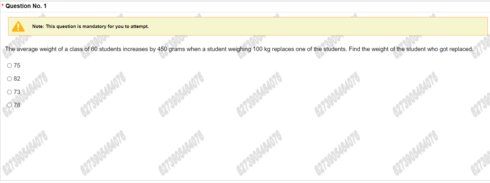
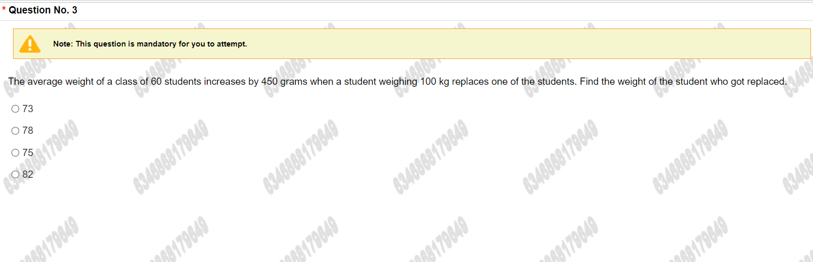
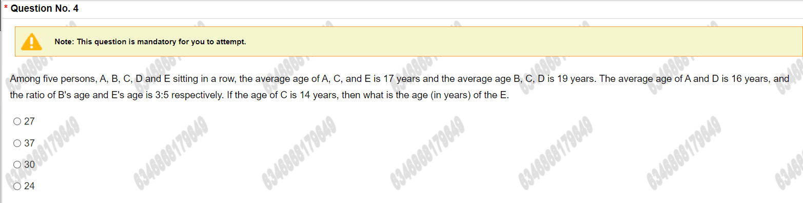
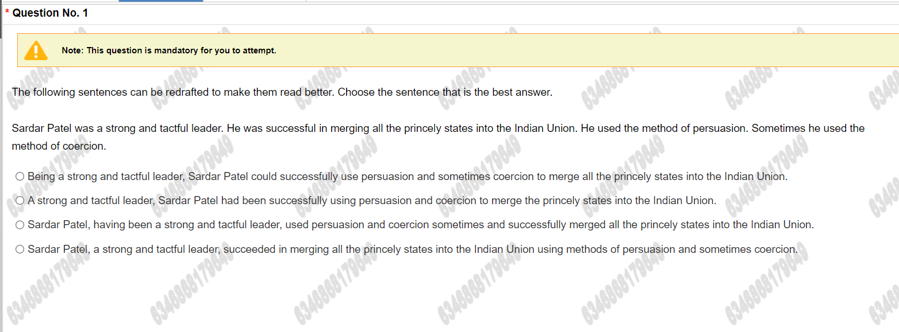
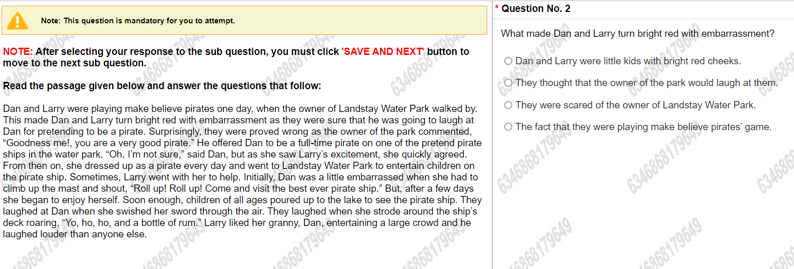
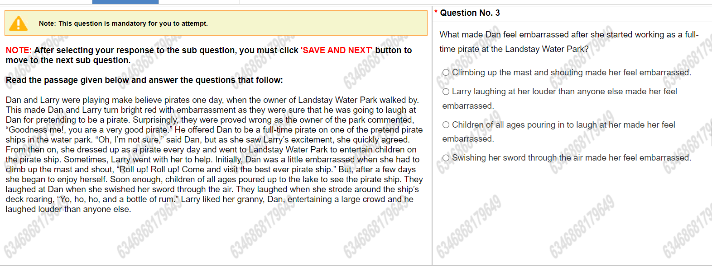
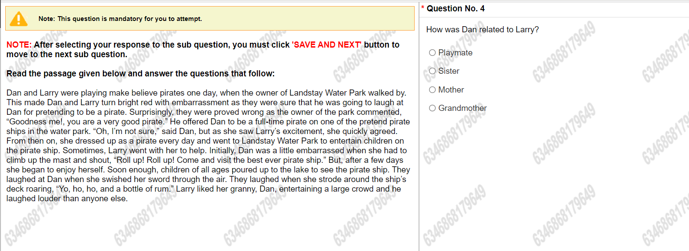
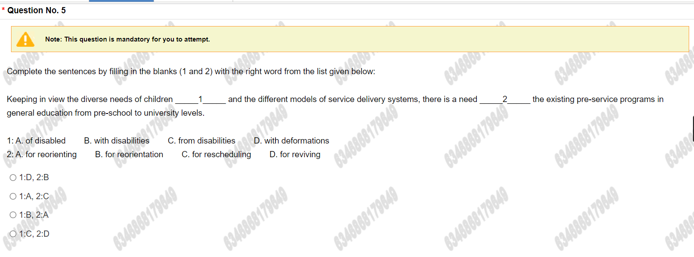
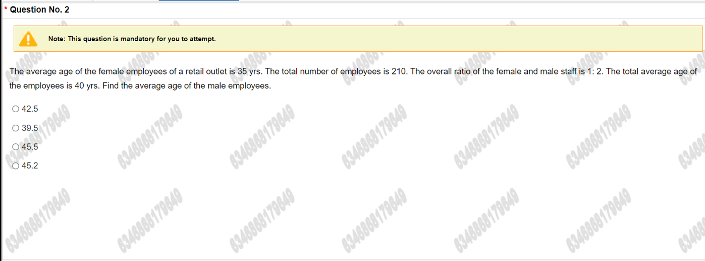
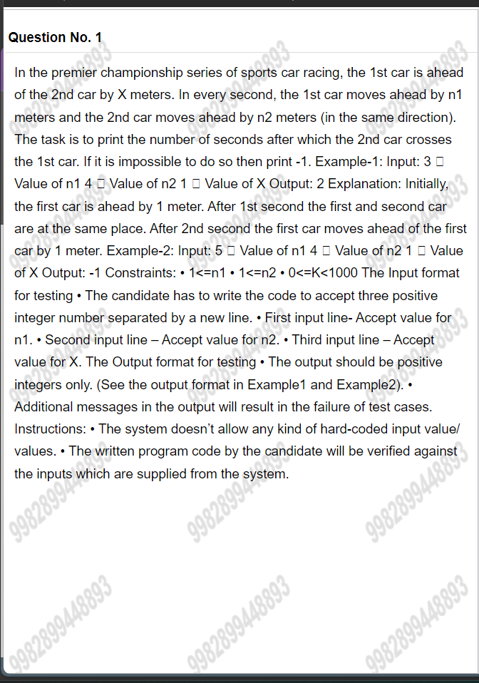

<link rel="stylesheet" href="./test/style.css">

# [TCS Questions](./tcs_question.md)

- [TCS Questions](#tcs-questions)
  - [Advanced Quantitative](#advanced-quantitative)
  - [Advanced Reasoning](#advanced-reasoning)
  - [Numerical Ability](#numerical-ability)
  - [Verbal Ability](#verbal-ability)
  - [Reasoning Ability](#reasoning-ability)
  - [Coding](#coding)

## Advanced Quantitative

> ### Question No. 1
>
> In a committee of 8 persons, there are 3 women and 5 men. Of these 5 men, One man is the Chairman of the committee and another man is the Convermer. The 8 committee members are to stand in a queue such that no two women can stand next to each other and the Chaiman must stand in some position before the Converner in the queue. The number of ways that this queue may be formed is

- 7200
- 7600
- 6400
- 8100

> ### Question No. 2
>
> Acylindrical container of 36 cm height and 48 cm diameter is filled with sand. Now its sand is used to form a conical heap of radius 30cm. The height (in cm) of the conical heap

- 87.96
- 68.84
- 70.22
- 89.12

## Advanced Reasoning

> ### Question No. 1
>
> In a certain coded language, SDURPQ stands for 'ROSTER. Which word would be coded as "UDOQPG?

- HACKLE
- HORNET
- HONEST
- VIOLIN

> ### Question No. 2
>
> A team of four is to be selected from among four Indian cricketers P, Q, R, S and four foreign cricketers W. X, Y, Z, meeting the given selection criteria: i. P and Y cannot be selected together. ii. If R is selected, X will also be selected and vice-versa. iii. Z and R cannot go together. iv. S and W will always be together. v. Q cannot be put with Z. If there would be equal number of Indian and foreign cricketers in the team, which option represents the four cricketers who can be selected as a team?

- SYRW
- XRZP
- OQWPS
- QRYX

## Numerical Ability

> ### Question No. 1
>
> 
>
> ### Question No. 2
>
> An amount becomes five times of its initial investments in a certain amount of time through simple interest. Find out the rate of interest of the transaction if the rate of interest equals to the number of years of the transaction,

- 25
- 20
- 50
- 40

> ### Question No. 3
>
> 
>
> ### Question No. 4
>
> 

---

## Verbal Ability

> ### Question No. 1
>
> 
>
> ### Question No. 2
>
> 
>
> ### Question No. 3
>
> 
>
> ### Question No. 4
>
> 
>
> ### Question No. 5
>
> 
>
> ### Question No. 6
>
> 

---

## Reasoning Ability

> ### Question No. 1
>
> 
>
> ### Question No. 2
>
> 
>
> ### Question No. 3
>
> 
>
> ### Question No. 4
>
> 

## Coding
>
> 
